# IMAT
Independent Modulator Analysis Toolbox

## What is IMAT?
Independent Modulator Analysis is a method for decomposing spectral fluctuations of temporally independent EEG sources into ‘spatio-spectrally’ distinct spectral modulator processes. Such processes might might derive from and isolate coordinated multiplicatively scaling effects of functionally near-independent modulatory factors, for example cortico-subcortical or sensory-cortical loops, or brainstem-centered import recognition systems linked to dopamine, serotonin, noradrenaline, etc. (see schematic figure below from [Onton & Makeig, 2009](https://www.frontiersin.org/articles/10.3389/neuro.09.061.2009/full))

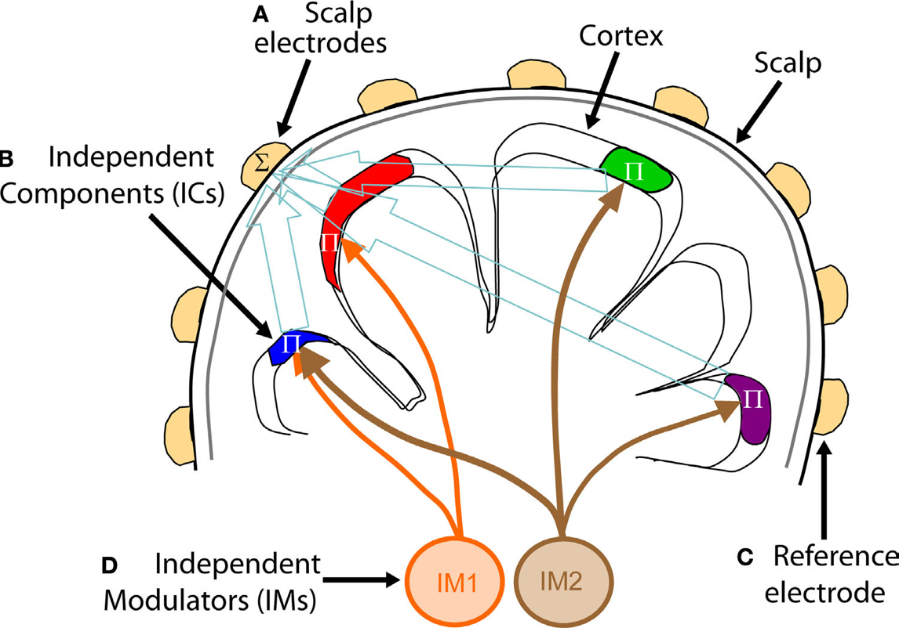  

Many studies of EEG spectral dynamics separate spectrographic data into a set of pre-defined broad or narrow frequency bands, then extract and operate on measures of these bands. However, to better understand the functional roles of local field dynamics contributing to the EEG, as well as individual differences in oscillatory dynamics, more flexible, data-driven models of spectral dynamics are needed.  
 
In the IMA method, multi-channel EEG data are first spatially decomposed using independent component analysis (ICA) into maximally independent component (IC) source processes. Then the temporal fluctuations in the concurrent joint IC log spectrograms are decomposed into independent modulator (IM) processes that are maximally independent over sources and frequency-weighting (see schematic figure below from [Onton & Makeig, 2006](https://sccn.ucsd.edu/~julie/HBM2006PosterMini.pdf)).

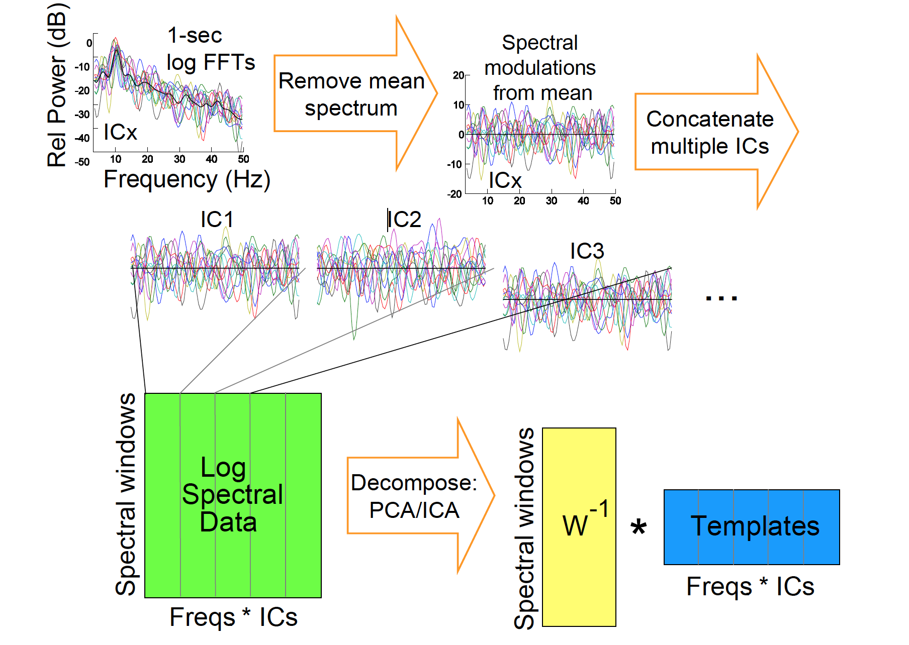 

IMAT has been developed by Johanna Wagner & Ramon Martinez-Cancino with Scott Makeig based on earlier work by Julie Onton and Scott ([Onton & Makeig, 2009](https://www.frontiersin.org/articles/10.3389/neuro.09.061.2009/full), [Onton & Makeig, 2006](https://sccn.ucsd.edu/~julie/HBM2006PosterMini.pdf)).

## Installing the IMAT plug-in in EEGLAB
All plug-ins in EEGLAB, including IMAT, can be installed in two ways. To install IMAT:

1. **From the EEGLAB Plug-in Manager:** Launch EEGLAB and select menu item **File > Manage EEGLAB Extensions** in the main EEGLAB window. A plug-in manager window will pop up. Look for and select the IMAT plug-in, then press **Install/Update**.

2. **From the web:** Download the IMAT plug-in zip file either from [this](https://github.com/sccn/imat) GitHub page (select ‘Download Zip‘) or from [this EEGLAB wiki plug-ins page](https://sccn.ucsd.edu/wiki/Plugin_list_all) (select **IMAT**). Decompress the zip file in the plug-ins folder in the main eeglab folder (*../eeglab/plugins/*).

Restart EEGLAB. If the installation is successful, a menu item to call IMAT, **Tools > Decompose IC spectograms by IMAT**, will appear in the EEGLAB menu.
 

## Requirements
1. Since IMAT is working on brain sources derived using Independent Component Analysis (ICA) you need to decompose the EEG data into Independent Components (ICs) using ICA before running IMAT. A description on how to preprocess EEG data and run ICA can be found in the [eeglab Wiki](https://eeglab.org/tutorials/06_RejectArtifacts/RunICA.html#run-ica).
2. For component selection and clustering it is of advantage to estimate also equivalent current dipoles for ICs. 
3. For automatic selection of components you need to install the eeglab plugin [IC Label](https://sccn.ucsd.edu/wiki/ICLabel)  
4. For plotting dipole density of clusters you need to install the eeglab plugin Fieldtrip lite.   
5. IMAT can handle epoched or continuous data. Be aware that for epoched data, the epochs should have length at least to accomodate 3 cycles of the lowest frequency at which IMA is computed. 

Please refer to the section above on how to install eeglab plugins. 

## Single subject analysis

## Running IMAT
Before running IMAT, start EEGLAB and load an EEG dataset.

To run IMAT on the loaded dataset, launch the Run IMA (*pop\_runIMA*) window, either by typing *pop\_runIMA* on the MATLAB command line or by calling it from the EEGLAB menu by selecting **Tools > Decompose spectograms by IMA > Run IMA**,  as highlighted in the figure below.

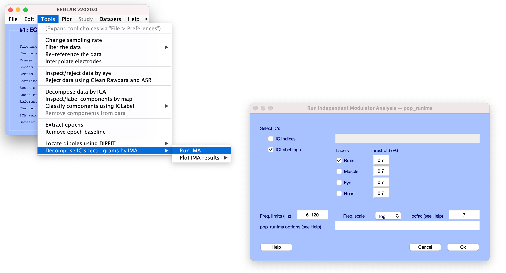 

From the resulting window (above right) we can specify:

1. The Independent Components (ICs) on which to run IMA - either a list of components (**IC Indices**) or we can choose to use IC Label to automatically select categories of ICs (**IC Label tags**). IMAT allows you to set individual thresholds for different categories of ICs for selecting ICs with IC Label.   
2. Which frequency reange to compute IMA on (**Freq. limits (Hz)**) 
3. The frequency scale (**Freq scale**) linear of log scale 
4. A factor to regulate dimensionality reduction on the time windows of the spectral data with PCA before ICA (**pcfac**) - the smaller pcfac, the more dimensions will be retained *ndims = (freqsxICs)/pcfac* where *freqs* is the number of estimated frequencies and *ICs* is the number of ICs (default is 7)
5. Other IMA options (**pop\_runima options**) – e.g., which ICA algorithm to use   (see *pop_runima* help for more details)

**Running IMA from the commandline**

*[EEG, IMA] = pop\_runIMA(EEG, 'freqscale', 'log', 'frqlim', [6 120], 'pcfac', 7, 'cycles', [6 0.5], 'selectICs', {'brain'}, 'icatype', 'amica');*

Here we are computing IMA on a single subject, selecting brain ICs using IC label, with parameters for time-frequency decomposition: log scale, frequency limit 6 to 120Hz, wavelet cycles [6 0.5], reducing the dimensions of timewindows
of the tf decomposition using pfac 7, and using AMICA as the ICA algorithm for IMA

## The IMA structure
  
*pop\_runIMA* is saving the IMA results in the IMA structure, which is saved in the same folder as the EEG file it is run on.  

After running IMA (either from the gui or from the commandline) type *IMA* in the Matlab command line to display the IMA structure.  
 
Alternatively the IMA file can be loaded using   

*IMA = load([EEG.etc.IMA.filepath '/' EEG.etc.IMA.filename], '-mat');*

**IMA structure**

The IMA structure has the following fields:

             wts: [21×21 double]
             sph: [21×21 double]
         meanpwr: [14×229 double]
         timevec: [1260×1 double]
         freqvec: [1×229 double]
       freqscale: 'log'
         freqlim: [6 120]
            npcs: 21
        complist: [1 2 3 4 5 6 8 9 10 11 17 21 27 38]
           srate: 500
         ntrials: 42
      ntw_trials: 30
         winsize: 0.5000
          eigvec: [1260×21 double]
              pc: [21×3206 double]
        timefreq: [1260×3206 double]
     meanpwrCond: []
     timepntCond: [1×1260 double]
       condition: []
    subjfilename: {'RestEC_S03_ContAMICAdip.set'}
    subjfilepath: {'/Volumes/ExtremeSSD/IMAT_project/IM/PreSTUDY/S03'}

**Detailed description of IMA outputs:**  
*IMA.wts - weights of IMA decomposition*  
*IMA.sph - spheres of IMA decomposition*  
*IMA.meanpwr - mean power spectra of single ICs*  
*IMA.timevec - timevector*  
*IMA.freqvec - frequency vector*  
*IMA.freqscale - frequency scale of computed spectra ('log' or 'linear')*  
*IMA.freqlim - frequency limits of spectra*  
*IMA.npcs - number of dimensions that have been used to reduce the data before IMA*   
*IMA.complist - component indices on which IMA was run on*  
*IMA.srate - original sampling rate of EEG data used to compute the spectra*  
*IMA.ntrials - number of trials used to commpute the tie-frequency decomposition*  
*IMA.ntw_trials - number of timewindows per trial*  
*IMA.winsize - window length in seconds for computing spectra in the time-frequency decomposition*
*IMA.eigvec - pc backprojection in time*  
*IMA.pc - pc spectral backprojection*  
*IMA.timefreq - time-frequency decomposition (spectograms for each IC)*  
*IMA.timepntCond - total number of timepoints in time-frequency decomposition*  
*IMA.timevec - timevector of full length of time-frequency decomposition*  
*IMA.subjfilename - the filename of the .ima file*  
*IMA.subjfilepath - the filepath of .ima file*  

## Visualizing IMAT results

There are three main plotting functions for visualizing IMAT results.

1. Superimposed components
2. Spectral envelope
3. Time courses

**1. Superimposed Components**  (*pop_plotspecdecomp*) 

To visualize the IM decomposition launch **Tools > Decompose spectograms by IMA > Plot IMA results > Superimposed Components**

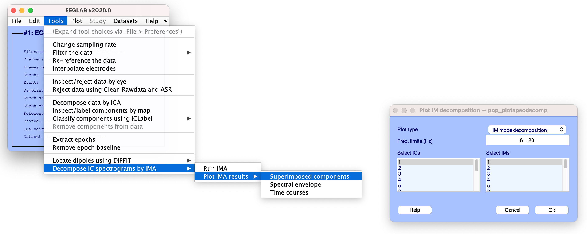 

In the resulting window (above right) we can specify: 

1. The type of plot from the drop down menu   
    - IM mode decomposition   
    - Superimposed IC modes  
    - Superimposed IM modes    
2. The frequency range to plot (must be within the frequencies for which IMA was    computed)
3. The ICs and IMs to plot

**IM mode decomposition**   
Allows to plot spectral templates separately for all IMs and ICs.   
At the commandline use: *pop_plotspecdecomp(EEG, 'plottype', 'comb')*  

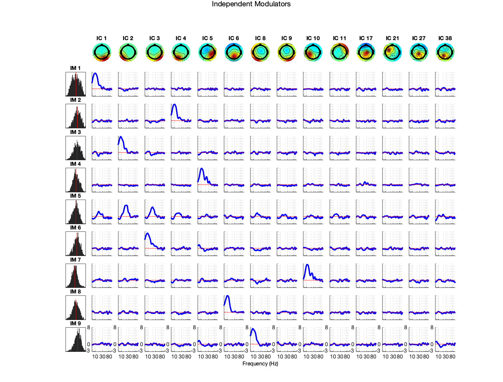 

**Superimposed IC modes**   
Allows to plot superimposed spectral templates of ICs for each IM.  
At the commandline use: *pop_plotspecdecomp(EEG, 'plottype', 'ics', 'comps', [1:7], 'factors', [1:8])*  

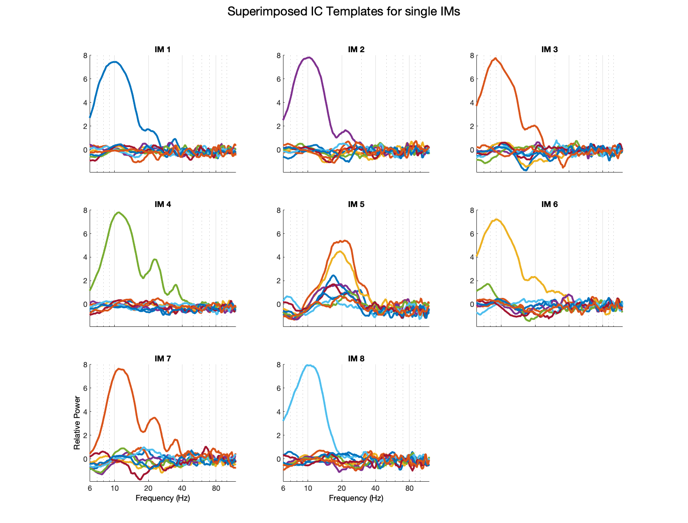 

**Superimposed IM modes**   
Allows to plot superimposed spectral templates of IMs for each IC.  
At the commandline use: *pop_plotspecdecomp(EEG, 'plottype', 'ims', 'comps', [1:6 8], 'factors', [1:8])*

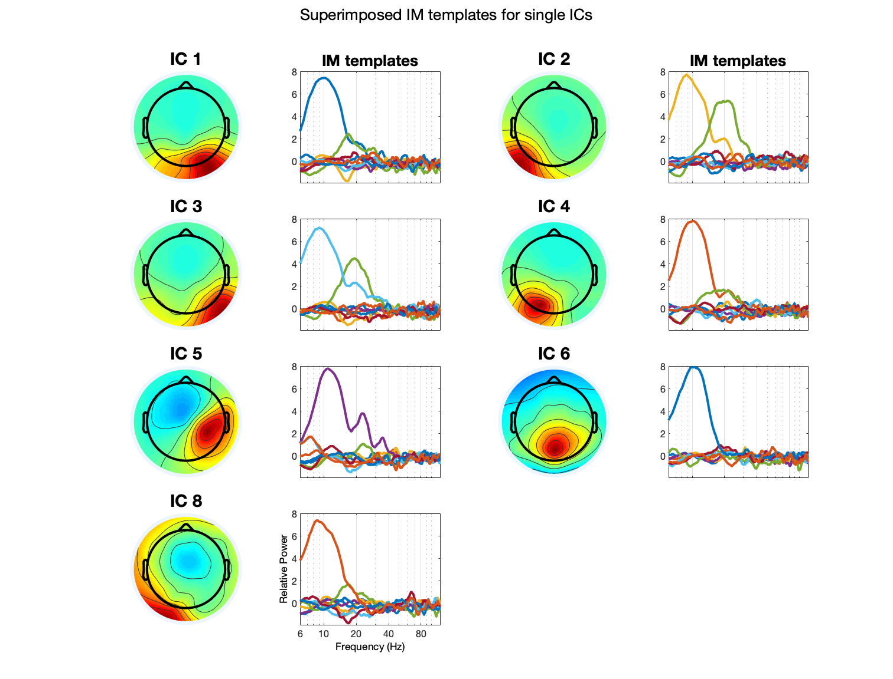 

**2. Spectral envelope** (*pop\_plotspecenv*)

To visualize the contribution of IMs on the mean log spectrum of an IC launch **Tools > Decompose spectograms by IMA > Plot IMA results > Spectral envelope**

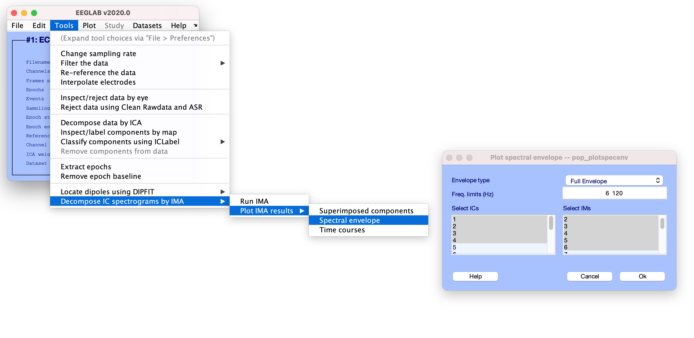

In the resulting window (above right) we can specify: 

1. The type of plot from the drop down menu   
    - Full envelope: plots the 1st and 99th percentiles of the IM spectral variation
    - Upper envelope: plots the 99th percentile of the IM spectral variation
    - Lower envelope: plots the 1st percentile of the IM spectral variation  
2. The frequency range to plot (must be within the frequencies for which IMA was    computed)
3. The ICs and IMs to plot

At the commandline use:  
*pop\_plotspecenv(EEG,'comps', [1 2 5], 'factors', [1 2 3 6], 'frqlim', [6 120], 'plotenv', 'full');*

Here is an example for plotting the **Full envelope** of IMs. The IC mean log power spectrum is shown as a black trace. Outer light grey limits represent the 1st and 99th percentiles of IC spectral variation. Dark grey areas represent the 1st and 99th percentiles of the PCA-reduced spectral data used in the IMA analysis.

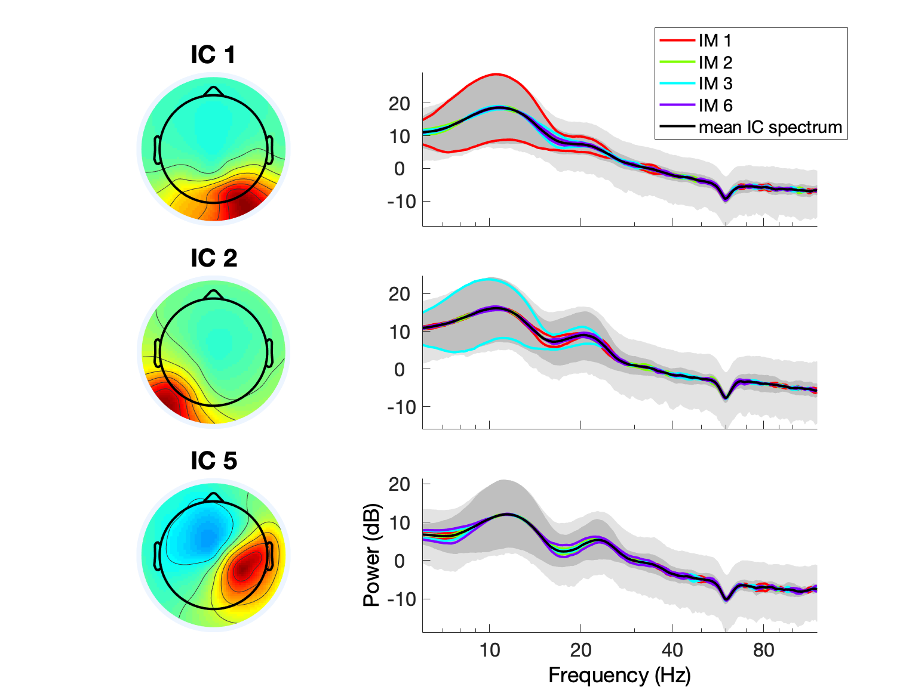

**3. Time courses** (*pop_plotIMtimecourse*)

To plot the activation of IMs over time launch **Tools > Decompose spectograms by IMA > Plot IMA results > Time courses**

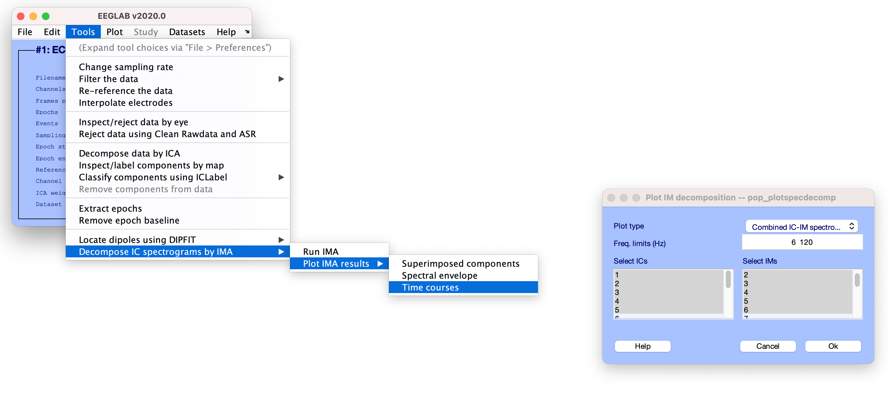

In the resulting window (above right) we can specify: 

1. The type of plot from the drop down menu   
    - IC spectogram   
    - Summed IM backprojection  
    - Combined IC-IM spectogram
    - IM timecourse    
2. The frequency range to plot (must be within the frequencies for which IMA was    computed)
3. The ICs and IMs to plot

**IC spectogram**   
Allows to plot the normalized (mean spectrum removed) IC spectograms.  
At the commandline use: *pop_plotIMtimecourse(EEG, 'comps', [1 2 6], 'frqlim', [6 120], 'plotICtf', 'on')* 
 
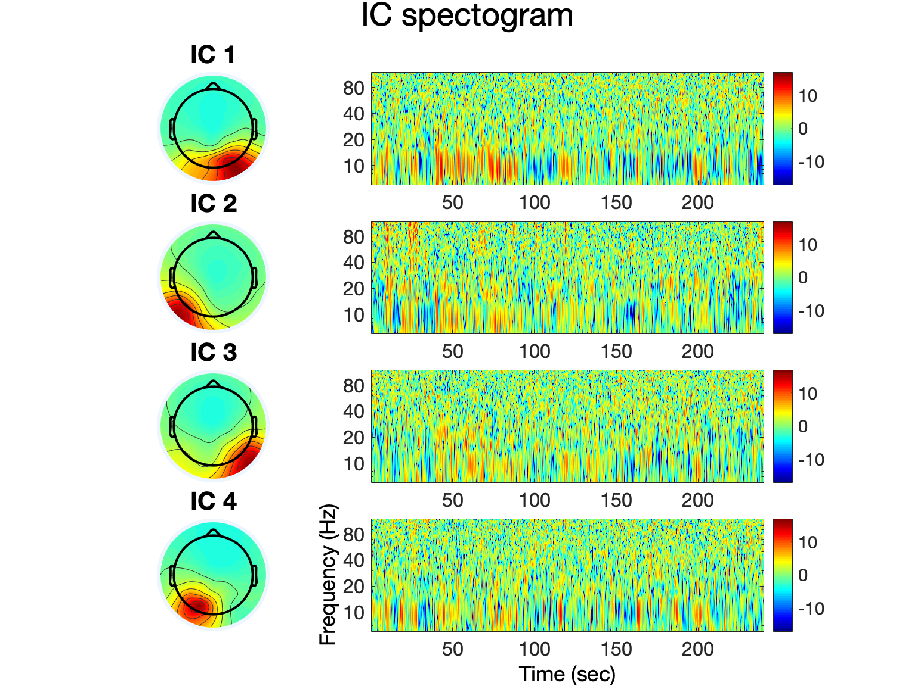

**Summed IM backprojection**  
Allows to plot the PCA reduced normalized (mean spectrum removed) IC spectograms on which IMA was computed.    
At the commandline use: *pop_plotIMtimecourse(EEG, 'comps', [1 2 6], 'frqlim', [6 120], 'plotPCtf', 'on')*
 
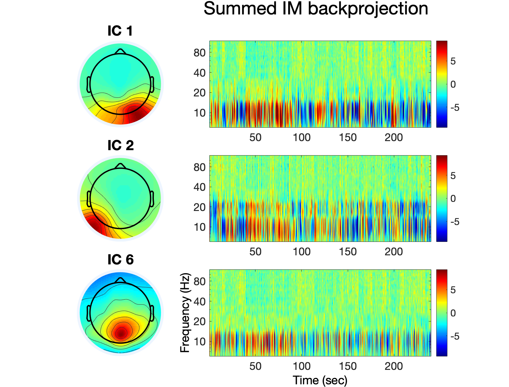

**Combined IC-IM spectogram**  
Allows to plot the backprojection of single IM spectral weights over time for single ICs.    
At the commandline use: *pop_plotIMtimecourse(EEG, 'comps', [1 2 6], 'frqlim', [6 120], 'factors', [1], 'plotIMtf', 'on')*

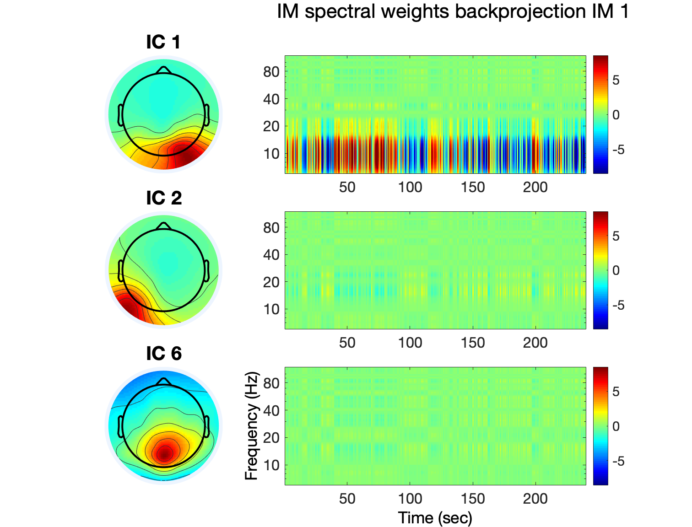

**IM timecourse**  
Allows to plot the activation of IMs over time.  
At the commandline use: *pop_plotIMtimecourse(EEG, 'frqlim', [6 120], 'factors', [1 2 3], 'smoothing', 40, 'plotIMtime', 'on')*

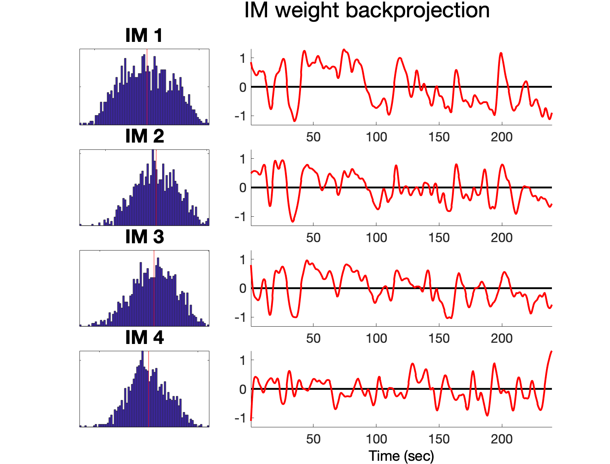

## Multiple conditions and group analysis 

## Running IMAT 

Before running IMAT on multiple conditions or for group analysis you need to build a STUDY in eeglab. You can find information on how to create a STUDY in the [eeglab wiki] (https://sccn.ucsd.edu/wiki/Chapter_02:_STUDY_Creation). For multiple conditions you will need to create a separate .set file for each condition. E.g. if you want to run IMA on EEG data that has two conditions: eyes open and eyes closed you need to create one EEG file for eyes open and one EEG file for eyes closed before creating the STUDY. 

Before running IMAT, start EEGLAB and load the STUDY set.

To run IMAT on the loaded STUDY, launch the Run IMA (*pop\_runIMA_study*) window, either by typing *pop\_runIMA_study* on the MATLAB command line or by calling it from the EEGLAB menu by selecting **STUDY > STUDY IMA > Run STUDY IMA**,  as highlighted in the figure below. This will run a separate IMA for each subject in the study. A joint IMA is automatically computed over all the conditions of each single subject in the STUDY.

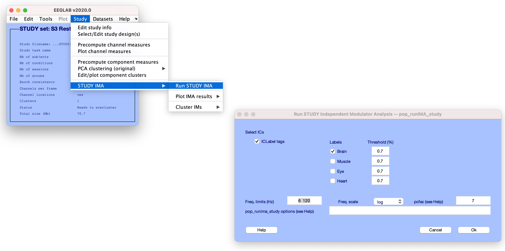 

From the resulting window (above right) we can specify:

1. We can choose to use IC Label to automatically select categories of ICs (**IC Label tags**). IMAT allows you to set individual thresholds for different categories of ICs for selecting ICs with IC Label. Otherwise IMAt will use the ICs previously specified when the STUDY was created.
2. Which frequency reange to compute IMA on (**Freq. limits (Hz)**) 
3. The frequency scale (**Freq scale**) linear of log scale 
4. A factor to regulate dimensionality reduction on the time windows of the spectral data with PCA before ICA (**pcfac**) - the smaller pcfac, the more dimensions will be retained *ndims = (freqsxICs)/pcfac* where *freqs* is the number of estimated frequencies and *ICs* is the number of ICs (default is 7)
5. Other IMA options (**pop\_runima_study options**) – e.g., which ICA algorithm to use   (see *pop_runima_study* help for more details)

**Running IMA from the commandline**

*[STUDY] = pop\_runIMA_study(STUDY, ALLEEG, 'freqscale', 'log','frqlim', [6 120],
                                          'pcfac', 7,
                                          'cycles', [6 0.5],
                                          'selectICs', {'brain'},
                                          'icatype', 'amica');*
                                          
Here we are computing IMA on the subjects conatined in the study set (a separate IMA is run on the data of each subject). We are selecting brain ICs using IC label, with parameters for time-frequency decomposition: log scale, frequency limit 6 to 120Hz, wavelet cycles [6 0.5], reducing the dimensions of timewindows of the tf decomposition using pfac 7, and using AMICA as the ICA algorithm for IMA.

## The IMA structure in the STUDY environment
  
*pop\_runIMA_study* is saving the IMA results in the IMA structure, which is associated to to the subject specific EEG files and saved in the same folder as the EEG files it is run on. 
 
The filenames of the subject specific IMA files are saved in:

*STUDY.etc.IMA*
   
     subjfilename: {{1×2 cell}}
     subjfilepath: {{1×2 cell}}
      imafilename: {'S3_S3_RestECEO.ima'}
      imafilepath: {'/Volumes/ExtremeSSD/IMAT_project/IM/PreSTUDY/S03'}
          subject: {'S3'}
         clustidx: [15×4 double]
         distance: [15×3 double]
     
 
The subject specific IMA file can be loaded using   

*IMA = load([ STUDY.etc.IMA.imafilepath{subjectindex} filesep STUDY.etc.IMA.imafilename{subjectindex}], '-mat' );*
   

**IMA structure**

The IMA structure has the following fields:

              wts: [21×21 double]
              sph: [21×21 double]
          meanpwr: [14×229 double]
          freqvec: [1×229 double]
          timevec: [2430×1 double]
     timevec_cond: {[30×42 double]  [30×39 double]}
        freqscale: 'log'
          freqlim: [6 120]
             npcs: 21
         complist: [1 2 3 4 5 6 8 9 10 11 17 21 27 38]
            srate: 500
          ntrials: [42 39]
       ntw_trials: 30
          winsize: 0.5000
      epochlength: 6
           eigvec: [2430×21 double]
               pc: [21×3206 double]
         timefreq: [2430×3206 double]
      meanpwrCond: [2×14×229 double]
      timepntCond: {[1×1260 double]  [1×1170 double]}
        condition: {'EC'  'EO'}
        STUDYname: 'RestECEO.study'
    STUDYfilepath: '/Volumes/IM/PreSTUDY/S03'
             subj: {'S3'}
     subjfilename: {'RestEC_S03_ContAMICAdip.set'  'RestEO_S03_ContAMICAdip.set'}
     subjfilepath: {'/Volumes/IM/PreSTUDY/S03'  '/Volumes/IM/PreSTUDY/S03'}
         filename: 'S3_RestECEO.ima'
       precluster: [1×1 struct]

Here in this example the IMA file is associated to two EEG files (2 conditions of the same subject), since a joint IMA is run over multiple conditions (saved in separate EEG.set files) of a single subject.

**Detailed description of IMA outputs:**

*IMA.wts - weights of IMA decomposition*  
*IMA.sph - spheres of IMA decomposition*  
*IMA.meanpwr - mean power spectra of single ICs*  
*IMA.timevec - timevector*  
*IMA.freqvec - frequency vector*  
*IMA.freqscale - frequency scale of computed spectra ('log' or 'linear')*  
*IMA.freqlim - frequency limits of spectra*  
*IMA.npcs - number of dimensions that have been used to reduce the data before IMA*  
*IMA.complist - component indices on which IMA was run on*  
*IMA.srate - original sampling rate of EEG data used to compute the spectra*  
*IMA.ntrials - number of trials used to commpute the time-frequency decomposition*  
*IMA.ntw_trials - number of timewindows per trial*  
*IMA.winsize - window length for computing spectra in the time-frequency decomposition*  
*IMA.epochlength - epochlength used for computing time-frequency decomposition in seconds*
*IMA.eigvec - pc backprojection in time*  
*IMA.pc - pc spectral backprojection*  
*IMA.timefreq - time-frequency decomposition (spectograms for each IC)*  
*IMA.timepntCond - total number of timepoints in time-frequency
                  decomposition in each condition*  
*IMA.timevec_cond - timevector of full length of time-frequency
                   decomposition for each condition*  
*IMA.meanpwrCond - mean power spectra for each IC and each condition*
*IMA.condition - names and order of conditions*  
*IMA.STUDYname - filename of the STUDY the IMA decomposition belongs to*  
*IMA.STUDYfilepath - filepath of the STUDY the IMA decomposition belongs to*  
*IMA.subj - subject the IMA has been comuted on*  
*IMA.subjfilename - filenames of the EEG data the IMA has been computed on*  
*IMA.subjfilepath - filepath of the EEG data the IMA has been computed on*  
*IMA.precluster - contains the collected spectral templates and the associated dipsources and scalpmaps collected during preclustering.*

## Visualizing IMAT results for single subjects in the STUDY and multiple conditions

There are three main plotting functions for visualizing IMAT results for single subjects and multiple conditions in the STUDY. These functions are very similar to the single subject IMAT visualizations discussed above.

1. Superimposed components
2. Spectral envelope
3. Time courses

**1. Superimposed Components**  (*pop\_plotspecdecomp_study*)

To visualize the IM decomposition for single subjects in the study launch **STUDY > STUDY IMA > Plot IMA results > Superimposed Components**

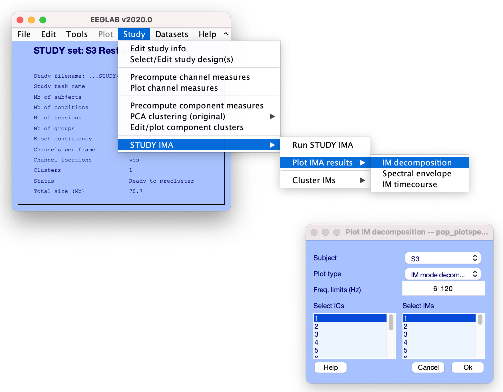 

In the resulting window (above right) we can specify: 

1. The subject for which to plot the IM decomposition
2. The type of plot from the drop down menu   
    - IM mode decomposition   
    - Superimposed IC modes  
    - Superimposed IM modes    
3. The frequency range to plot (must be within the frequencies for which IMA was    computed)
4. The ICs and IMs to plot

At the commandline use:   
*pop\_plotspecdecomp_study(STUDY, 'plottype', 'comb', 'subject', '3')*  
*pop\_plotspecdecomp_study(STUDY, 'plottype', 'ics', 'subject', '3')*  
*pop\_plotspecdecomp_study(STUDY, 'plottype', 'ims', 'subject', '3')*  

The type of plots are the same as for single subjects visualizations, please refer to the section above for more information. 

**2. Spectral envelope** (*pop\_plotspecenv_study*)

To visualize the contribution of IMs on the mean log spectrum of an IC for a single subject launch **STUDY > STUDY IMA > Plot IMA results > Spectral envelope**

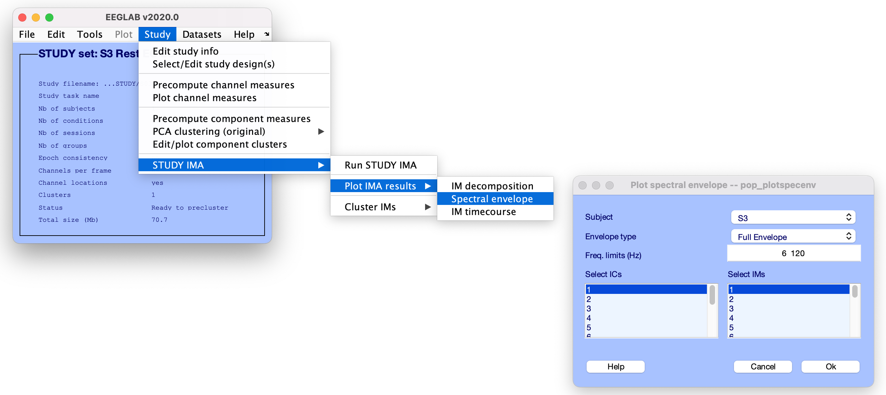

In the resulting window (above right) we can specify: 

1. The subject for which to plot the spectral envelope
2. The type of plot from the drop down menu   
    - Full envelope: plots the 1st and 99th percentiles of the IM spectral variation
    - Upper envelope: plots the 99th percentile of the IM spectral variation
    - Lower envelope: plots the 1st percentile of the IM spectral variation  
3. The frequency range to plot (must be within the frequencies for which IMA was    computed)
4. The ICs and IMs to plot

The function is automatically plotting separate spectral loadings for each condition. Here is an example for plotting the **Full envelope** of IMs for an eyes open and eyes closed condition separately. The IC mean log power spectrum is shown as a black trace. Outer light grey limits represent the 1st and 99th percentiles of IC spectral variation. Dark grey areas represent the 1st and 99th percentiles of the PCA-reduced spectral data used in the IMA analysis.

At the commandline use: 
*pop\_plotspecenv_study(STUDY,'comps', [1 2 5], 'factors', [1 2 3 6], 'frqlim', [6 120],'plotcond', 'on', 'subject', '3');*

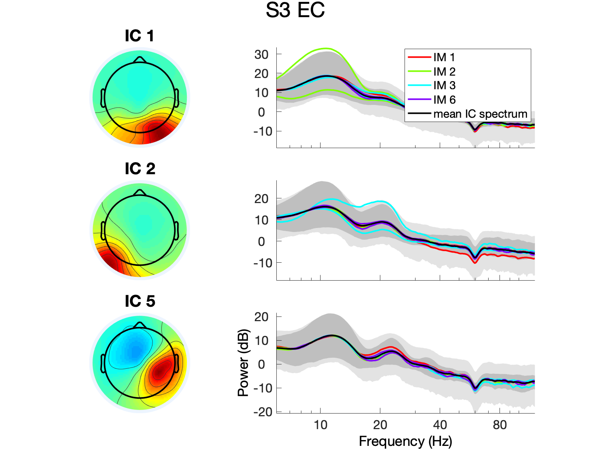

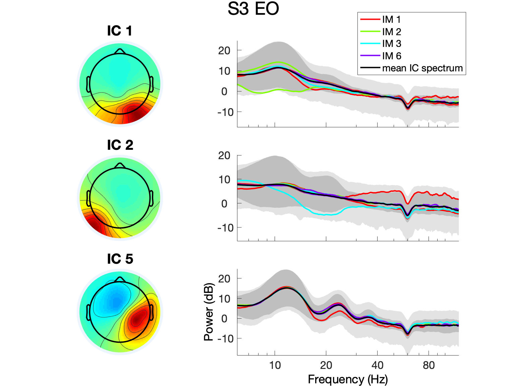

**3. Time courses** (*pop_plotIMtimecourse_study*)

To plot the activation of IMs over time for a single subject launch **STUDY > STUDY IMA > Plot IMA results > Time courses**

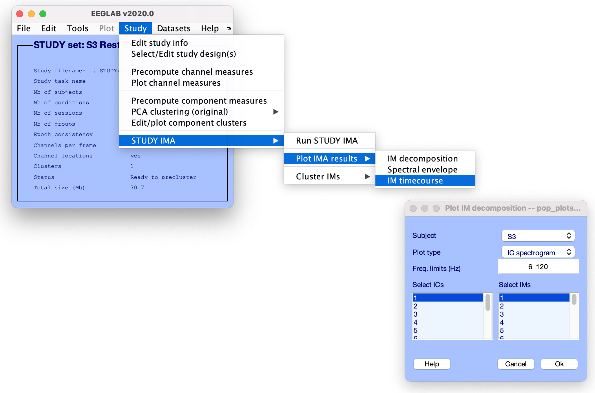

In the resulting window (above right) we can specify: 

1. The subject for which to plot the spectral envelope
2. The type of plot from the drop down menu   
    - IC spectogram   
    - Summed IM backprojection  
    - Combined IC-IM spectogram
    - IM timecourse    
3. The frequency range to plot (must be within the frequencies for which IMA was    computed)
4. The ICs and IMs to plot

The function automatically plots a black vertical line at the timepoint of transition between conditions

**IC spectogram**   
Allows to plot the normalized (mean spectrum removed) IC spectograms.    
At the commandline use: *pop_plotIMtimecourse_study(STUDY, 'comps', [1 2 6], 'frqlim', [6 120], 'plotcond', 'on', 'plotICtf', 'on', 'subject', '3')*
 
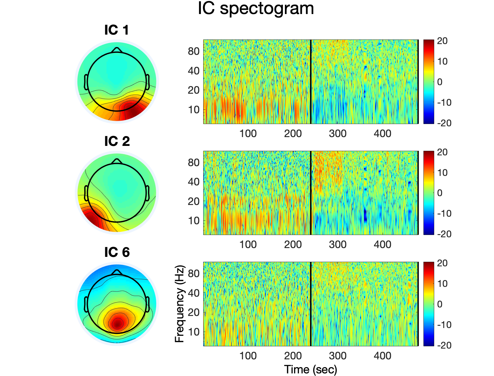

**Summed IM backprojection**  
Allows to plot the PCA reduced normalized (mean spectrum removed) IC spectograms on which IMA was computed.    
At the commandline use: *pop_plotIMtimecourse_study(STUDY, 'comps', [1 2 6], 'frqlim', [6 120], 'plotcond', 'on', 'plotPCtf', 'on', 'subject', '3')*
     
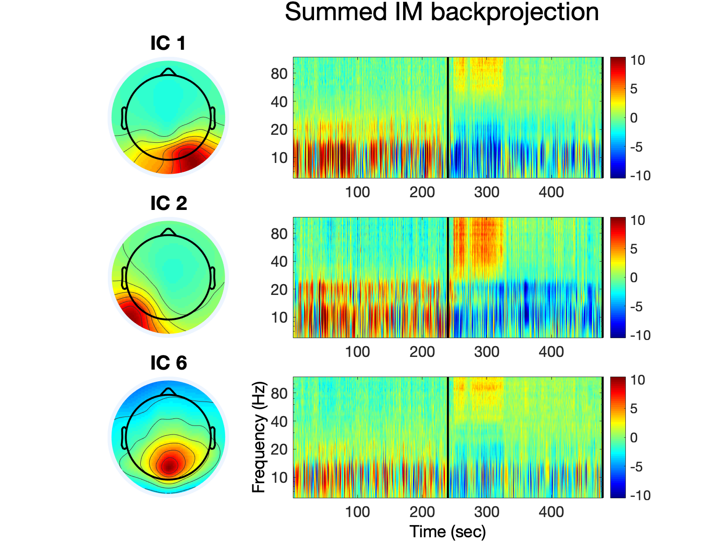

**Combined IC-IM spectogram** 
Allows to plot the backprojection of single IM spectral weights over time for single ICs.
At the commandline use: *pop_plotIMtimecourse_study(STUDY, 'comps', [1 2 6], 'factors', [1], 'frqlim', [6 120], 'plotcond', 'on', 
    'plotIMtf', 'on', 'subject', '3')*

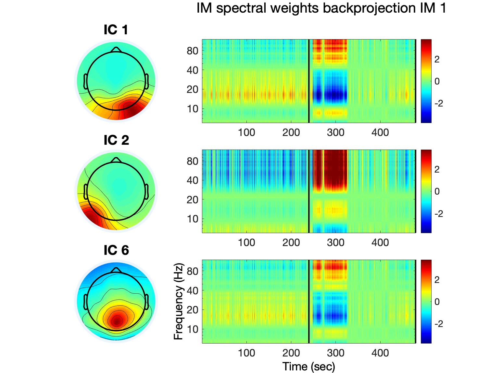

**IM timecourse** 
Allows to plot the activation of IMs over time, visualizing differences between condition.  
At the commandline use: *pop_plotIMtimecourse_study(STUDY, 'factors', [1 2 3], 'frqlim', [6 120], 'plotcond', 'on', 'smoothing', 40,
    'plotIMtime', 'on', 'subject', '3')*

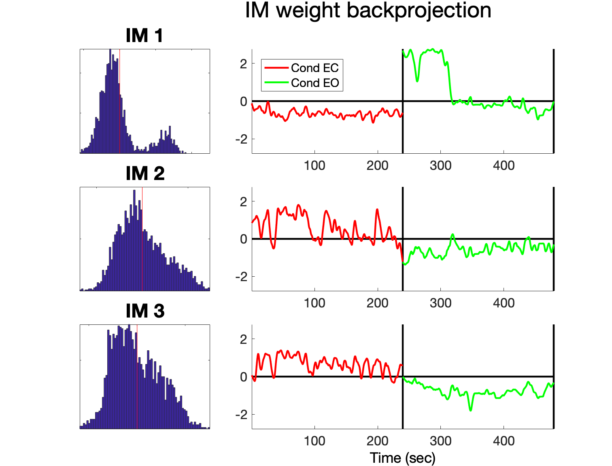

## Clustering IM spectral templates

There are 3 main steps when clustering IM spectral templates
1. Preclustering
2. Clustering
3. Plot clusters

**Preclustering**  

Before clustering we need to select the relevant spectral templates for clustering and remove spectral templates that do not show activation in the relevant frequency range. To select the spectral templates for clustering launch **STUDY > STUDY IMA > Cluster IMs > Collect templates**

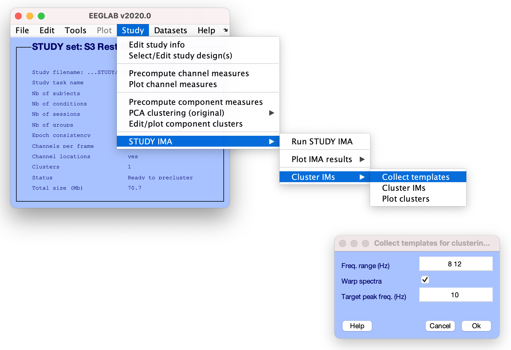

In the resulting window (above right) we can specify: 

1. **Freq range** The relevant frequency range: this includes only templates that are active or have peaks in the specified range of frequencies. If empty templates with activations in any frequency range are chosen (templates with low activations are removed)
2. **Warp spectra** Whether the spectra should be warped to a certain frequency: stretches templates in the frequency range defined by 'Freq. range' using the subject specific median template peak frequency within the band defined in 'Freq. range' to stretch spectra to a predefined peak as defined in 'Target peak freq'.Use is only reccomended when a narrow enough frequency band is defined in 'Freq. range'. i.e. 8-14Hz           
3. **Target peak freq** The target peak frequency: defines the target frequency to stretch spectra to when 'stretch_spectra' is 'on', if 'Target peak freq' is empty uses the center frequency of 'Freq. range'

At the commandline use: 
*pop\_collecttemplates(STUDY, 'peakrange', [8 12],
                                    'stretch_spectra', 'on',
                                    'targetpeakfreq', 10,
                                    'plot_templ', 'on');*  
                                    
Here we are collecting spectral templates for clustering that have a peak in the frequency band [8 12] Hz, we are choosing to warp the spectra to the 'targetpeakfreq' at 10 Hz. We choose to plot the collected templates.

The collected spectral templates and the associated dipsources and scalpmaps are saved in the subject specific IMA file in *IMA.precluster*. 

     templates: [15×229 double]
     IMICindex: [15×2 double]
    dipsources: [1×15 struct]
     scalpmaps: [15×67×67 double]
    
     
*IMA.precluster.IMICindex* contains the indices of spectral templates collected for clustering. The first column are the indices of IMs, the second column the indices of the ICs that show relevant spectral loadings on the IMs.  
                                    
**Cluster IM spectral templates** (*pop_clusterIMAtemplates*)

To cluster the IM spectral templates collected in the previous step launch **STUDY > STUDY IMA > Cluster IMs > Cluster IMs**   

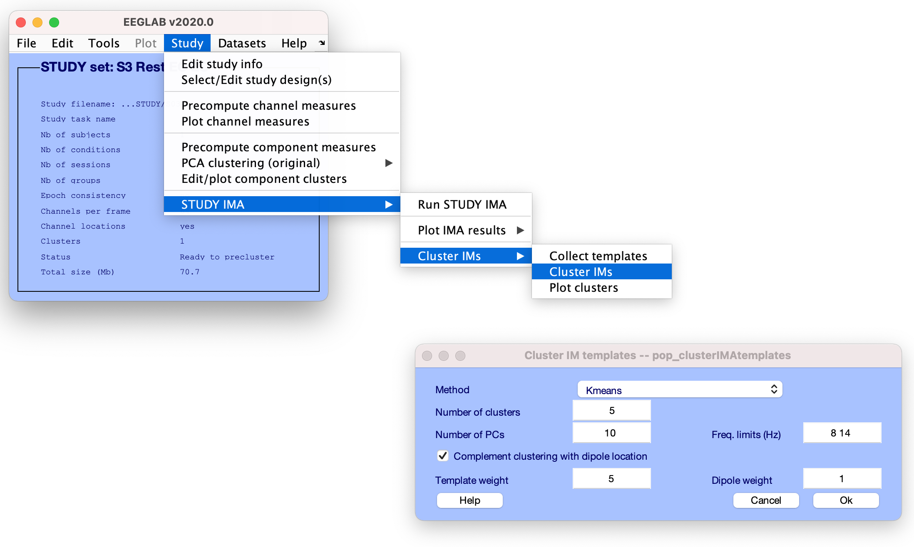  

In the resulting window (above right) we can specify: 

1. **Method** The method for clustering. Currently only k-means is implemented
2. **Number of clusters** The number of clusters to compute          
3. **Number of PCs** number of principal IM spectral template dimensions to retain for clustering
4. **Freq limits** frequency limits to restrict clustering to i.e. alpha frequency range [8 14]. The default is the whole frequency range on which IMA was computed
5. **Complement clustering with dipole location** use dipole locations in addition to spectral templates for clustering
6. **Template weight** weight to assign to spectral templates for clustering when clustering on spectral templates and dipole locations. A number between 1 and 20, default is 1. A larger number will give more weight to spectral templates compared to dipole locations.
7. **Dipole weight**  weight to assign to dipole locations for clustering when clustering on spectral templates and dipole locations. A number between 1 and 20, default is 1. A larger number will give more weight to dipole locations compared to spectral templates

At the commandline use: 
*[STUDY] = pop_clusterIMAtemplates(STUDY, ALLEEG, 'nclust', 5, 'pcs', 10, 'freqlim', [8 14],'dipole_locs', 'on', 'weightSP', 5, 'weightDP', 2);*

Here we are clustering the previously collected spectral templates using 5 clusters and 10 principal IM spectral template dimensions to retain for clustering. We are chhosing to cluster on the alpha frequency range 8-14 Hz. We also choose complement clustering with dipole location. We assign weight 5  to the spectral templates and weight 2 to the dipole locations for clustering. 

The cluster indices and the distance of spectral templates in the cluster space are saved in *STUDY.etc.IMA*. 
   
     clustidx: [15×4 double]
     distance: [15×3 double]
     
*STUDY.etc.IMA.clustidx* consists of 4 columns: column 1 is the subject number, column 2 the IM index, column 3 the IC index and column 4 the cluster index - which cluster the spectral template was assigned to.
*STUDY.etc.IMA.distance* has as many columns as clusters. Each column contains the euclidean distances of spectral templates to a specific cluster.

**Plotting cluster results**

To plot cluster results launch **STUDY > STUDY IMA > Cluster IMs > Plot clusters**  

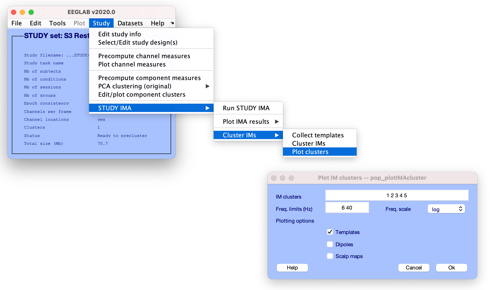  

In the resulting window (above right) we can specify: 

1. **IM clusters** Which clusters to plot
2. **Freq limits** Frequency limits for plotting spectral templates           
3. The frequency scale (**Freq scale**) linear or log scale for plotting the spectral templates
4. **Templates** Plot spectral template clusters
5. **Dipoles** plot dipole densities of spectral template clusters
6. **Scalp maps** plot scalp maps of spectral template clusters

At the commandline use:   
*pop_plotIMAcluster(STUDY, 'clust', [1 2 3], 'freqlim', [6 40],'freqscale', 'log','plottemplates', 'on', 'plotscalpmaps', 'on', 'plotdipsources', 'on')*

**Templates**

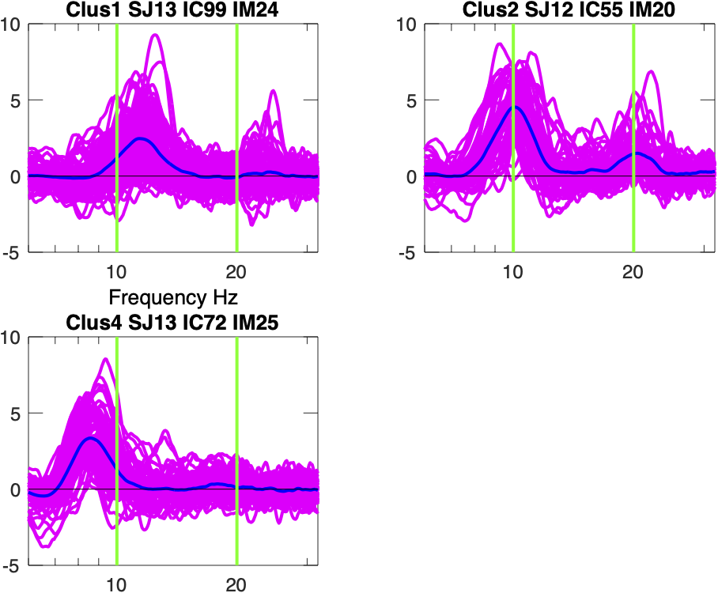  

**Dipoles**

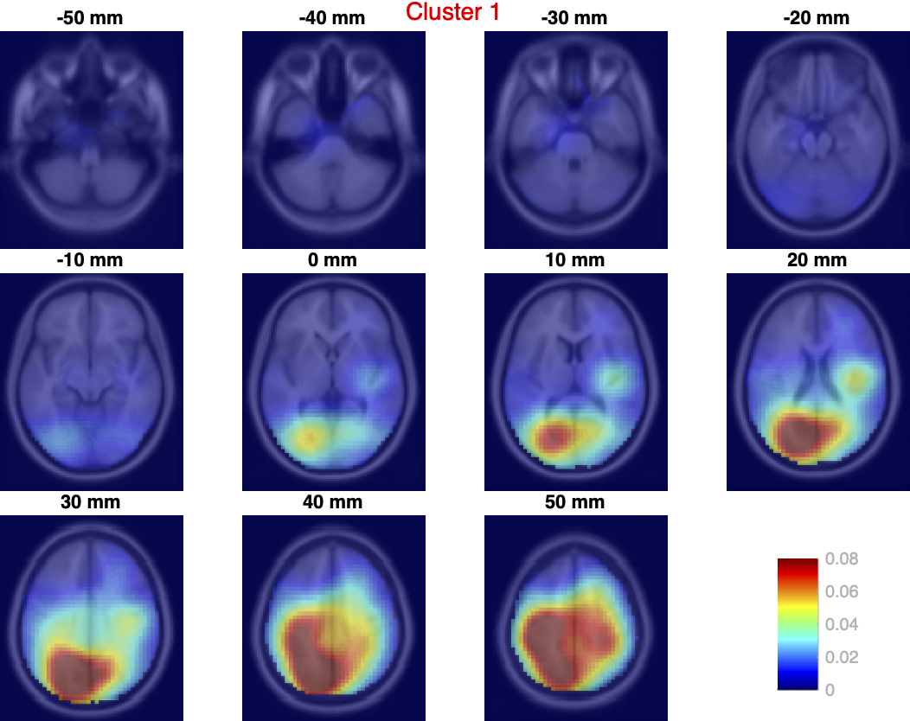

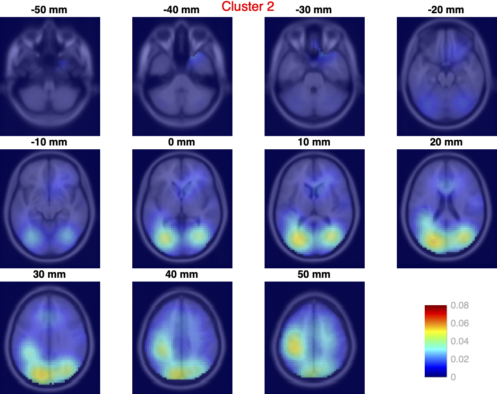

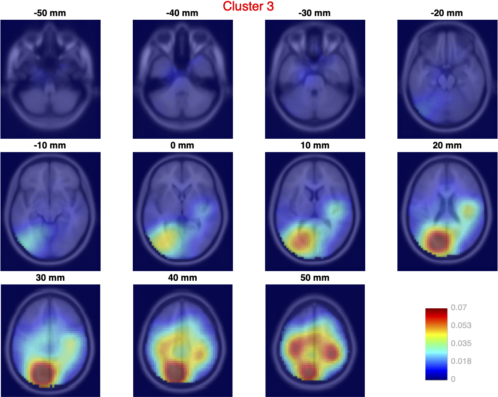

