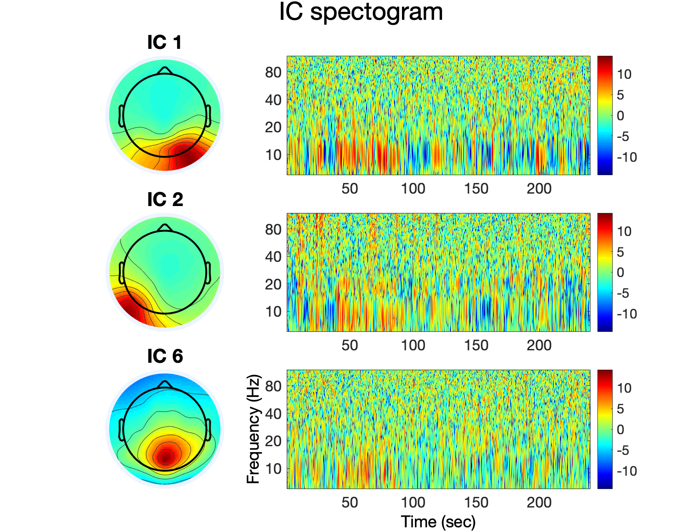
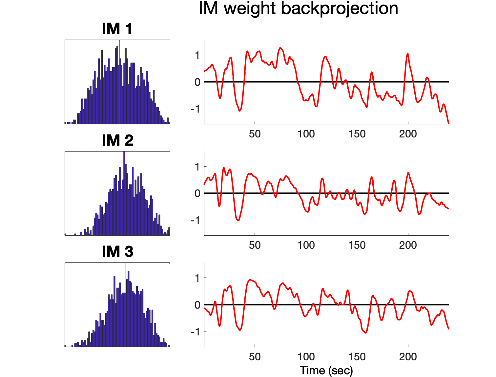
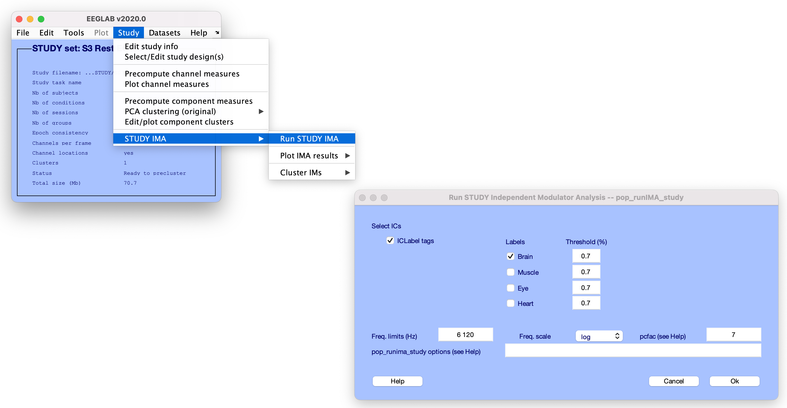

# IMAT
Independent Modulator Analysis Toolbox

## What is IMAT?
Independent Modulator Analysis is a method for decomposing spectral fluctuations of temporally independent EEG sources into ‘spatio-spectrally’ distinct spectral modulator processes. Such processes might might derive from and isolate coordinated multiplicatively scaling effects of functionally near-independent modulatory factors, for example cortico-subcortical or sensory-cortical loops, or brainstem-centered import recognition systems linked to dopamine, serotonin, noradrenaline, etc. (see schematic figure below from [Onton & Makeig, 2009](https://www.frontiersin.org/articles/10.3389/neuro.09.061.2009/full))

  

Many studies of EEG spectral dynamics separate spectrographic data into a set of pre-defined broad or narrow frequency bands, then extract and operate on measures of these bands. However, to better understand the functional roles of local field dynamics contributing to the EEG, as well as individual differences in oscillatory dynamics, more flexible, data-driven models of spectral dynamics are needed.  
 
In the IMA method, multi-channel EEG data are first spatially decomposed using independent component analysis (ICA) into maximally independent component (IC) source processes. Then the temporal fluctuations in the concurrent joint IC log spectrograms are decomposed into independent modulator (IM) processes that are maximally independent over sources and frequency-weighting (see schematic figure below from [Onton & Makeig, 2006] (/Docs/HBM2006PosterMini.pdf).

 

IMAT has been developed by Johanna Wagner & Ramon Martinez-Cancino with Scott Makeig based on earlier work by Julie Onton and Scott ([Onton & Makeig, 2009](https://www.frontiersin.org/articles/10.3389/neuro.09.061.2009/full), [Onton & Makeig, 2006] (/Docs/HBM2006PosterMini.pdf)).

## Installing the IMAT plug-in in EEGLAB
All plug-ins in EEGLAB, including IMAT, can be installed in two ways. To install IMAT:

1. **From the EEGLAB Plug-in Manager:** Launch EEGLAB and select menu item **File > Manage EEGLAB Extensions** in the main EEGLAB window. A plug-in manager window will pop up. Look for and select the IMAT plug-in, then press **Install/Update**.

2. **From the web:** Download the IMAT plug-in zip file either from [this](https://github.com/sccn/imat) GitHub page (select ‘Download Zip‘) or from [this EEGLAB wiki plug-ins page](https://sccn.ucsd.edu/wiki/Plugin_list_all) (select **IMAT**). Decompress the zip file in the plug-ins folder in the main eeglab folder (*../eeglab/plugins/*).

Restart EEGLAB. If the installation is successful, a menu item to call IMAT, **Tools > Decompose IC spectograms by IMAT**, will appear in the EEGLAB menu.
 

## Requirements
1. Since IMAT is working on brain sources derived using Independent Component Analysis (ICA) you need to decompose the EEG data into Independent Components (ICs) using ICA before running IMAT. A description on how to preprocess EEG data and run ICA can be found in the [eeglab Wiki] (https://eeglab.org/tutorials/06_RejectArtifacts/RunICA.html#run-ica).
2. For component selection and clustering it is of advantage to estimate also equivalent current dipoles for ICs. 
3. For automatic selection of components you need to install the eeglab plugin [IC Label] (https://sccn.ucsd.edu/wiki/ICLabel)  

## Single subject analysis

## Running IMAT
Before running IMAT, start EEGLAB and load an EEG dataset.

   Here we will use the sample EEGLAB dataset,  *.../eeglab/sample\_data/eeglab\_data\_epochs\_ica.set*.

To run IMAT on the loaded dataset, launch the Run IMA (*pop\_runIMA*) window, either by typing *pop\_runIMA* on the MATLAB command line or by calling it from the EEGLAB menu by selecting **Tools > Decompose spectograms by IMA > Run IMA**,  as highlighted in the figure below.

 

From the resulting window (above right) we can specify:

1. The Independent Components (ICs) on which to run IMA - either a list of components (**IC Indices**) or we can choose to use IC Label to automatically select categories of ICs (**IC Label tags**). IMAT allows you to set individual thresholds for different categories of ICs for selecting ICs with IC Label.   
2. Which frequency reange to compute IMA on (**Freq. limits (Hz)**) 
3. The frequency scale (**Freq scale**) linear of log scale 
4. A factor to regulate dimensionality reduction on the time windows of the spectral data with PCA before ICA (**pcfac**) - the smaller pcfac, the more dimensions will be retained *ndims = (freqsxICs)/pcfac* where *freqs* is the number of estimated frequencies and *ICs* is the number of ICs (default is 7)
5. Other IMA options (**pop\_runima options**) – e.g., which ICA algorithm to use   (see *pop_runima* help for more details)

## Visualizing IMAT results

There are three main plotting functions for visualizing IMAT results.

1. Superimposed components
2. Spectral envelope
3. Time courses

**1. Superimposed Components**  

To visualize the IM decomposition launch **Tools > Decompose spectograms by IMA > Plot IMA results > Superimposed Components**

**Plot IM decomposition**  (*pop_plotspecdecomp*) 

 

In the resulting window (above right) we can specify: 

1. The type of plot from the drop down menu   
    - IM mode decomposition   
    - Superimposed IC modes  
    - Superimposed IM modes    
2. The frequency range to plot (must be within the frequencies for which IMA was    computed)
3. The ICs and IMs to plot

**IM mode decomposition** allows to plot spectral templates separately for all IMs and ICs 

 

**Superimposed IC modes** allows to plot superimposed spectral templates of ICs for each IM  

 

**Superimposed IM modes** allows to plot superimposed spectral templates of IMs for each IC

 

**2. Spectral envelope**

To visualize the contribution of IMs on the mean log spectrum of an IC launch **Tools > Decompose spectograms by IMA > Plot IMA results > Spectral envelope**

In the resulting window (above right) we can specify: 

1. The type of plot from the drop down menu   
    - Full envelope: plots the 1st and 99th percentiles of the IM spectral variation
    - Upper envelope: plots the 99th percentile of the IM spectral variation
    - Lower envelope: plots the 1st percentile of the IM spectral variation  
2. The frequency range to plot (must be within the frequencies for which IMA was    computed)
3. The ICs and IMs to plot

Here is an example for plotting the **Full envelope** of IMs. The IC mean log power spectrum is shown as a black trace. Outer light grey limits represent the 1st and 99th percentiles of IC spectral variation. Dark grey areas represent the 1st and 99th percentiles of the PCA-reduced spectral data used in the IMA analysis.

**3. Time courses**

To plot the activation of IMs over time launch **Tools > Decompose spectograms by IMA > Plot IMA results > Time courses**

In the resulting window (above right) we can specify: 

1. The type of plot from the drop down menu   
    - IC spectogram   
    - Summed IM backprojection  
    - Combined IC-IM spectogram
    - IM timecourse    
2. The frequency range to plot (must be within the frequencies for which IMA was    computed)
3. The ICs and IMs to plot

**IC spectogram** allows to plot the normalized (mean spectrum removed) IC spectograms.
 

**Summed IM backprojection** allows to plot the PCA reduced normalized (mean spectrum removed) IC spectograms on which IMA was computed.
 

**Combined IC-IM spectogram** allows to plot the backprojection of single IM spectral weights over time for single ICs

**IM timecourse** allows to plot the activation of IMs over time

## Multiple conditions and group analysis 

## Running IMAT 

Before running IMAT on multiple conditions or for group analysis you need to build a STUDY in eeglab. You can find information on how to create a STUDY in the [eeglab wiki] (https://sccn.ucsd.edu/wiki/Chapter_02:_STUDY_Creation). For multiple conditions you will need to create a separate .set file for each condition. E.g. if you want to run IMA on EEG data that has two conditions: eyes open and eyes closed you need to create one EEG file for eyes open and one EEG file for eyes closed before creating the STUDY. 

Before running IMAT, start EEGLAB and load the STUDY set.

   Here we will use the sample STUDY set,  *.../eeglab/sample\_data/eeglab\_data\_epochs\_ica.set*.

To run IMAT on the loaded STUDY, launch the Run IMA (*pop\_runIMA_study*) window, either by typing *pop\_runIMA_study* on the MATLAB command line or by calling it from the EEGLAB menu by selecting **STUDY > STUDY IMA > Run STUDY IMA**,  as highlighted in the figure below. This will run a separate IMA for each subject in the study. A joint IMA is automatically computed over all the conditions of each single subject in the STUDY.

 

From the resulting window (above right) we can specify:

1. We can choose to use IC Label to automatically select categories of ICs (**IC Label tags**). IMAT allows you to set individual thresholds for different categories of ICs for selecting ICs with IC Label. Otherwise IMAt will use the ICs previously specified when the STUDY was created.
2. Which frequency reange to compute IMA on (**Freq. limits (Hz)**) 
3. The frequency scale (**Freq scale**) linear of log scale 
4. A factor to regulate dimensionality reduction on the time windows of the spectral data with PCA before ICA (**pcfac**) - the smaller pcfac, the more dimensions will be retained *ndims = (freqsxICs)/pcfac* where *freqs* is the number of estimated frequencies and *ICs* is the number of ICs (default is 7)
5. Other IMA options (**pop\_runima_study options**) – e.g., which ICA algorithm to use   (see *pop_runima_study* help for more details)

## Visualizing IMAT results for single subjects in the STUDY and multiple conditions

There are three main plotting functions for visualizing IMAT results for single subjects and multiple conditions in the STUDY. These functions are very similar to the single subject IMAT visualizations discussed above.

1. Superimposed components
2. Spectral envelope
3. Time courses

**1. Superimposed Components**  

To visualize the IM decomposition for single subjects in the study launch **STUDY > STUDY IMA > Plot IMA results > Superimposed Components**

**Plot IM decomposition**  (*pop_plotspecdecomp_study*) 

 

In the resulting window (above right) we can specify: 

1. The subject for which to plot the IM decomposition
2. The type of plot from the drop down menu   
    - IM mode decomposition   
    - Superimposed IC modes  
    - Superimposed IM modes    
3. The frequency range to plot (must be within the frequencies for which IMA was    computed)
4. The ICs and IMs to plot

The type of plots are the same as for single subjects visualizations, please refer to the section above for more information. 

**2. Spectral envelope**

To visualize the contribution of IMs on the mean log spectrum of an IC for a single subject launch **STUDY > STUDY IMA > Plot IMA results > Spectral envelope**

In the resulting window (above right) we can specify: 

1. The subject for which to plot the spectral envelope
2. The type of plot from the drop down menu   
    - Full envelope: plots the 1st and 99th percentiles of the IM spectral variation
    - Upper envelope: plots the 99th percentile of the IM spectral variation
    - Lower envelope: plots the 1st percentile of the IM spectral variation  
3. The frequency range to plot (must be within the frequencies for which IMA was    computed)
4. The ICs and IMs to plot

The function is automatically plotting separate spectral loadings for each condition. Here is an example for plotting the **Full envelope** of IMs for an eyes open and eyes closed condition separately. The IC mean log power spectrum is shown as a black trace. Outer light grey limits represent the 1st and 99th percentiles of IC spectral variation. Dark grey areas represent the 1st and 99th percentiles of the PCA-reduced spectral data used in the IMA analysis.

**3. Time courses**

To plot the activation of IMs over time for a single subject launch **STUDY > STUDY IMA > Plot IMA results > Time courses**

In the resulting window (above right) we can specify: 

1. The subject for which to plot the spectral envelope
2. The type of plot from the drop down menu   
    - IC spectogram   
    - Summed IM backprojection  
    - Combined IC-IM spectogram
    - IM timecourse    
3. The frequency range to plot (must be within the frequencies for which IMA was    computed)
4. The ICs and IMs to plot

The function automatically plots a black vertical line at the timepoint of transition between conditions

**IC spectogram** allows to plot the normalized (mean spectrum removed) IC spectograms.
 

**Summed IM backprojection** allows to plot the PCA reduced normalized (mean spectrum removed) IC spectograms on which IMA was computed.
 

**Combined IC-IM spectogram** allows to plot the backprojection of single IM spectral weights over time for single ICs

**IM timecourse** allows to plot the activation of IMs over time, visualizing differences between condition

## Clustering IMs

## Running and visualizing IMAT from the MATLAB command line
Running IMAT, can also be performed from the MATLAB command line or by a MATLAB script. 

**Single subject analysis**

**Running IMA**
 
*[EEG, IMA] = pop\_runIMA(EEG, 'freqscale', 'linear', 'frqlim', [6 120], 'pcfac', 8, 'cycles', [6 0.5], 'selectICs', {'brain'}, 'icatype', 'infomax');*

**Plotting IMA results**

*pop_plotspecdecomp(EEG, 'plottype', 'comb', 'comps', [1 2 3 4 5 6])*  
*pop_plotspecdecomp(EEG, 'plottype', 'ics', 'comps', [1 2 3 4 5 6])*  
*pop_plotspecdecomp(EEG, 'plottype', 'ims', 'comps', [1 2 3 4 5 6])*

*pop\_plotspecenv(EEG,'comps', [1 2 3 4 5 6], 'factors', [1 2 4 5], 'frqlim', [3 40], 'plotenv', 'upper');%, 'setminmax', [30 80]);*

*pop_plotIMtimecourse(EEG, 'comps', [1 2 3], 'factors', [1 5], 'frqlim', [6 40], 'smoothing', 0.1)* 

**Multiple subjects and /or multiple conditions analysis (STUDY)**

**Loading STUDY**  

*[ALLEEG EEG CURRENTSET ALLCOM] = eeglab;*  
*[STUDY ALLEEG] = pop_loadstudy('filename', 'S3_RestECEO.study', 'filepath', '/Users/amon-ra/WORK/Data/IMAT_data');*    
*eeglab redraw;*  

**Running IMA**   
*[STUDY] = pop\_runIMA_study(STUDY, ALLEEG, 'freqscale', 'log','frqlim', [6 120],
                                          'pcfac', 8,
                                          'cycles', [6 0.5],
                                          'selectICs', {'brain'},
                                          'icatype', 'infomax');*

**Plotting Options**

*pop\_plotspecdecomp_study(STUDY, 'plottype', 'comb')*

*pop\_plotspecenv_study(STUDY,'comps', [1 3 5 6], 'factors', [1 2 3 5 7], 'frqlim', [3 40],'plotcond', 'on');*

*pop_plotIMtimecourse_study(STUDY, 'comps', [1 3 5], 'factors', [1 5], 'frqlim', [6 40], 'plotcond', 'on', 'smoothing', 0.1,
    'plotIMtf', 'on', 'plotIMtime', 'on')*

**Clustering**   

**Preclustering**  
*[IMA] = pop\_collecttemplates(STUDY, 'peakrange', [8 14],
                                    'stretch_spectra', 'on',
                                    'targetpeakfreq', 10,
                                    'plot_templ', 'on');*  
                                    
**Cluster IMs**  
*[STUDY] = pop_clusterIMAtemplates(STUDY, ALLEEG, 'nclust', 3);*

**Plot Clusters**  
*pop_plotIMAcluster(STUDY, 'plotclust','on', 'plottemplates', 'on', 'plotscalpmaps', 'on', 'plotdipsources', 'on', 'plotsubclusters', 'on')*

